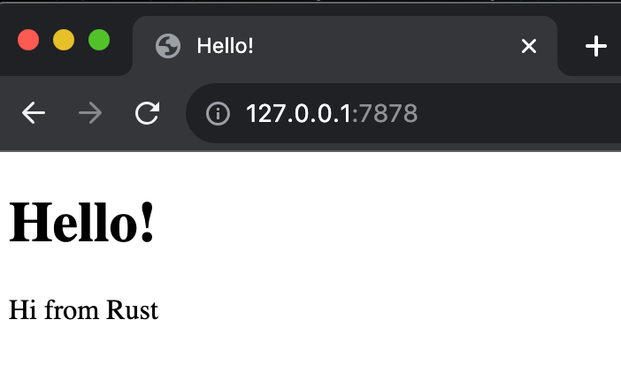

# multi threaded web server

A simple implementation of a multi-threaded web server.
The server utilizes a thread pool to efficiently process multiple connections concurrently, optimizing performance.
Graceful shutdown and cleanup is accomplished by allowing ongoing requests to be completed by any active threads prior to closing.

## Prerequisites
- rustc >= 1.71.0 
- cargo >= 1.71.0

## Usage

```sh
$ cargo run
```

<br>



## License

[MIT License](LICENSE])